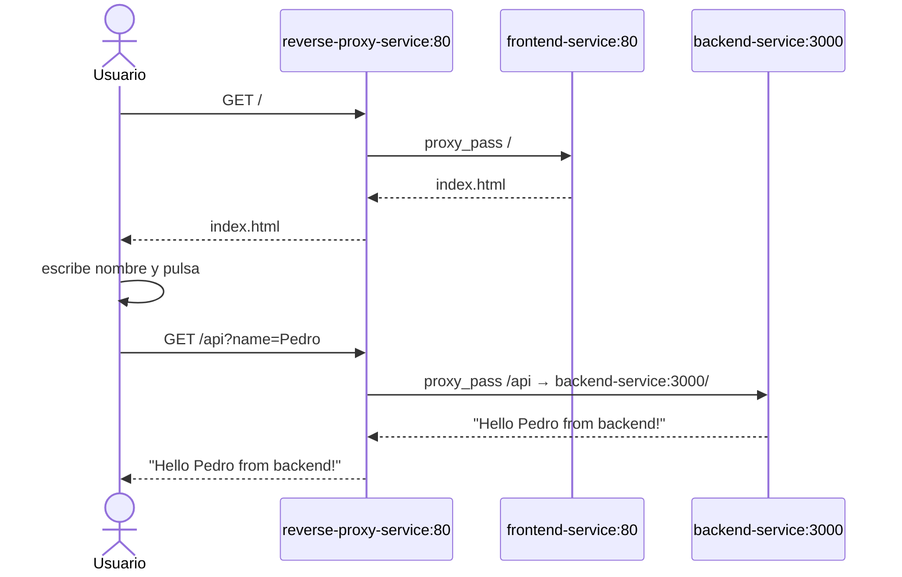
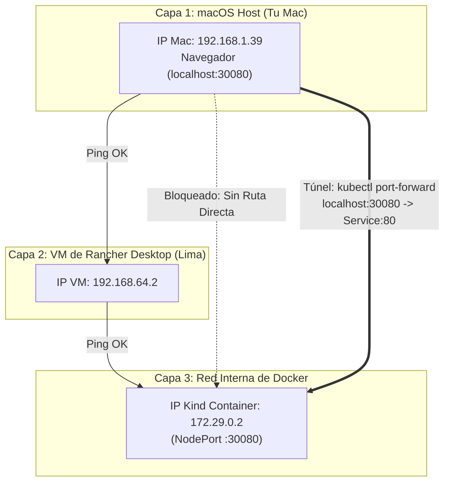

# demo-kind · _Despliegue Kubernetes con Kind_

Este proyecto despliega los mismos tres servicios (**reverse-proxy**, **frontend** y **backend**) del proyecto [demo-compose](https://github.com/mapfre-gitops-9/docker-compose), pero usando **Kind** (Kubernetes in Docker) como orquestador en lugar de docker-compose.

## Antecedentes

Este proyecto nace como evolución de [demo-compose](https://github.com/mapfre-gitops-9/demo-compose), donde los mismos servicios se orquestaban con `docker-compose`. En aquel repositorio puedes encontrar:

- El historial de problemas típicos al Meter contenedores en desarrollo (resolución de nombres, CORS, reverse proxy, etc.)
- Cada paso documentado como una lección independiente
- La versión "plana" con `docker-compose`

Este repositorio parte de esa misma base pero migrada a un despliegue Kubernetes sobre Kind.

## El proyecto

```
docs/                       ← Documentación administrativa y de apoyo
├── acuerdos-trabajo.md
├── administracion-imagenes.md
└── buenas-practicas-seguridad.md
k8s/                        ← manifiestos Kubernetes
├── backend-deployment.yaml
├── backend-service.yaml
├── frontend-deployment.yaml
├── frontend-service.yaml
├── reverse-proxy-configmap.yaml
├── reverse-proxy-deployment.yaml
├── reverse-proxy-service.yaml
└── kustomization.yaml
backend/                    ← app Node.js/Express (misma que en demo-compose)
frontend/                   ← HTML estático servido por nginx (misma que en demo-compose)
reverse-proxy/              ← Dockerfile para construir imagen local (demo-compose)
```

> **Documentación Adicional:**
> * Para entender cómo colaboramos en el repositorio, la estrategia de ramas y el proceso de revisión de código, consulta la [Guía de Acuerdos de Trabajo y Desarrollo](file:///Users/pedroamador/testlab/mapfre-gitops-9/demo-kind/docs/acuerdos-trabajo.md).
> * Para ver detalles sobre cómo configurar los registros, permisos de la organización y el pipeline de integración continua, consulta la [Guía de Gestión y Publicación de Imágenes](file:///Users/pedroamador/testlab/mapfre-gitops-9/demo-kind/docs/administracion-imagenes.md).
> * Para conocer las directrices sobre cómo evitar fugas de credenciales o datos sensibles durante el desarrollo diario (BAU), consulta la [Guía de Buenas Prácticas de Seguridad y Prevención de Fugas](file:///Users/pedroamador/testlab/mapfre-gitops-9/demo-kind/docs/buenas-practicas-seguridad.md).


La arquitectura es la misma que en la versión con docker-compose: el **reverse-proxy** es el único punto de entrada. Recibe todas las peticiones y decide:

| Ruta  | Destino                 | Servicio Kubernetes    |
|-------|-------------------------|------------------------|
| `/`   | `frontend-service:80`   | `frontend-service`     |
| `/api`| `backend-service:3000`  | `backend-service`      |




## Componentes Kubernetes

| Recurso | Tipo | Réplicas | Puerto |
|---------|------|----------|--------|
| `backend` | Deployment | 2 | 3000 |
| `frontend` | Deployment | 2 | 80 |
| `reverse-proxy` | Deployment | 1 | 80 |
| `backend-service` | Service (ClusterIP) | — | 3000 |
| `frontend-service` | Service (ClusterIP) | — | 80 |
| `reverse-proxy-service` | Service (NodePort) | — | 80 → `:30080` |
| `reverse-proxy-config` | ConfigMap | — | nginx default.conf |

El **reverse-proxy-service** se expone como `NodePort` en el puerto `30080` del host, siendo el único punto de entrada al clúster.

## Cómo desplegar

### Prerrequisitos

- [Docker](https://docker.com)
- [Kind](https://kind.sigs.k8s.io)
- [kubectl](https://kubernetes.io/docs/tasks/tools/)

### Pasos

```bash
# 1. Construir las imágenes Docker
docker build -t ghcr.io/mapfre-gitops-9/demo-backend:latest ./backend
docker build -t ghcr.io/mapfre-gitops-9/demo-frontend:latest ./frontend

# 2. Crear el clúster Kind (si no existe)
kind create cluster

# 3. Cargar las imágenes en el clúster
kind load docker-image ghcr.io/mapfre-gitops-9/demo-backend:latest
kind load docker-image ghcr.io/mapfre-gitops-9/demo-frontend:latest

# 4. Desplegar con kustomize
kubectl apply -k k8s/

# 5. Verificar que los pods están running
kubectl get pods

# 6. Probar
curl http://localhost:30080
# o abre http://localhost:30080 en el navegador
```

> **Nota:** El reverse-proxy usa la imagen `nginx:alpine` directamente con un ConfigMap, por lo que no necesita construcción ni carga adicional.

### Limpieza

```bash
# Eliminar el despliegue
kubectl delete -k k8s/

# Eliminar el clúster Kind
kind delete cluster
```

## Caso Especial: macOS + Rancher Desktop (Arquitectura de Red)

Si estás utilizando **Rancher Desktop** en macOS para ejecutar el motor de Docker y Kubernetes, te encontrarás con una limitación de red clásica al intentar acceder a la aplicación desde tu navegador local a través de `http://localhost:30080`.

### El porqué de la inaccesibilidad directa

En macOS, los contenedores de Docker no corren nativamente; se ejecutan dentro de una máquina virtual (administrada por Rancher Desktop, comúnmente usando Lima). Esto introduce tres capas de red aisladas:

1. **Tu macOS Host:** La red física de tu ordenador (por ejemplo, la IP `192.168.1.39`).
2. **La Máquina Virtual de Rancher Desktop:** Corre sobre una interfaz de red propia (por ejemplo, la IP `192.168.64.2`). Tu Mac tiene ruta directa a esta máquina virtual.
3. **La Red Interna de Docker:** Creada dentro de la máquina virtual (por ejemplo, la subred `172.29.0.0/16` donde el clúster Kind tiene el nodo en la IP `172.29.0.2`). 



Como **tu macOS (Capa 1) no sabe cómo enrutar paquetes hacia la Red Interna de Docker (Capa 3)**, cualquier petición directa a `http://localhost:30080` (o incluso a la IP del contenedor `172.29.0.2:30080`) fallará desde tu navegador. Sin embargo, sí funciona si accedes con un shell a la VM de Rancher Desktop (`rdctl shell`) y la ejecutas desde allí.

### La Solución: kubectl port-forward

Para resolver este aislamiento y poder interactuar con el entorno de desarrollo directamente desde tu navegador en macOS, debes crear un puente (túnel TCP) directo al servicio de Kubernetes.

Ejecuta el siguiente comando en tu terminal de macOS:

```bash
kubectl port-forward service/reverse-proxy-service 30080:80
```

**¿Cómo funciona esto?**
* Escucha peticiones locales en tu Mac en `localhost:30080`.
* Canaliza el tráfico a través del socket de conexión de la API de Kubernetes gestionado por Rancher, saltándose las barreras de red.
* Entrega las peticiones directamente al pod del **reverse-proxy-service** en el puerto `80`.

Una vez activo el comando, ya puedes abrir la aplicación en tu navegador de macOS:
[http://localhost:30080](http://localhost:30080)

## Resolución de Problemas (Troubleshooting)

### 1. Error `403 Forbidden` al acceder al Frontend

Si tras desplegar el proyecto y configurar el `port-forward` intentas acceder y recibes un error `403 Forbidden` firmado por Nginx (por ejemplo, `nginx/1.31.2`), estás ante un problema clásico de permisos de archivos en contenedores.

#### Causa Raíz
Cuando Docker copia archivos del host al contenedor (`COPY index.html ...`), estos heredan las propiedades y permisos de archivo del sistema anfitrión. 

Si el archivo `index.html` en tu máquina de desarrollo o servidor de compilación tiene permisos de lectura restringidos (por ejemplo, `rw-------` o lectura exclusiva para tu usuario en el host), al compilarse la imagen:
* El servidor web Nginx dentro del contenedor (que corre bajo el usuario no privilegiado `nginx`) no tendrá permisos para leer `/usr/share/nginx/html/index.html`.
* Al no poder leer el recurso de entrada, Nginx denegará el acceso devolviendo un código de error HTTP `403`.

Puedes confirmarlo revisando los logs del pod del frontend:
```bash
kubectl logs deployment/frontend
# Deberías ver un error del estilo:
# "... open() "/usr/share/nginx/html/index.html" failed (13: Permission denied) ..."
```

#### Solución
Para evitar este problema de portabilidad entre diferentes entornos y sistemas operativos de desarrollo:
1. **Solución en caliente en el Host (antes de compilar):** Asegúrate de que el archivo tenga permisos de lectura global en tu máquina host antes de ejecutar el build:
   ```bash
   chmod 644 frontend/index.html
   ```
2. **Solución integrada en la compilación (Automatizada):** En el [Dockerfile](file:///Users/pedroamador/testlab/mapfre-gitops-9/demo-kind/frontend/Dockerfile) del frontend, se fuerza que el archivo copiado sea legible para cualquier usuario añadiendo la instrucción `RUN chmod 644 /usr/share/nginx/html/index.html` justo después de la copia del archivo. Esto garantiza que la imagen construida funcione correctamente en cualquier entorno.

## Recursos de Aprendizaje (Laboratorios Prácticos)

Para aquellos compañeros que se estén iniciando en el mundo de los contenedores y la orquestación (con la meta de familiarizarse con Kubernetes u OpenShift), la práctica interactiva es el mejor camino. 

Aquí dispones de las mejores alternativas gratuitas para aprender directamente desde el navegador, sin necesidad de instalar nada en tu equipo:

### 1. Cursos Guiados Paso a Paso (LabEx.io)
**[LabEx.io](https://labex.io)** te permite registrarte gratis (por ejemplo, con tu cuenta de Gmail) y te guía de forma estructurada en laboratorios con explicaciones teóricas y retos prácticos paso a paso:

*   **[Linux for Noobs / Quick Start with Linux](https://labex.io):** Ideal para familiarizarse con la línea de comandos, navegación de directorios y permisos de archivos (muy útil para comprender los errores de Nginx vistos en la sección de troubleshooting).
*   **[Docker for Beginners / 30 Days of Docker](https://labex.io):** Aprende los conceptos fundamentales de contenedores: imágenes, redes, volúmenes de datos, puertos y cómo escribir tus propios Dockerfiles.
*   **[Kubernetes for Noobs / Kubernetes Practice Labs](https://labex.io):** Da tus primeros pasos con un clúster Minikube real ejecutando comandos `kubectl` para crear deployments, exponer servicios y escalar pods.

### 2. Entornos Interactivos y Escenarios Libres (Killercoda & Playgrounds)
Si prefieres un enfoque al puro estilo de la mítica y desaparecida **Katacoda** (pantalla partida con guía interactiva a la izquierda y un terminal real a la derecha donde se autocompletan los comandos al hacer clic):

*   **[Killercoda](https://killercoda.com/):** Es el sucesor directo de Katacoda. Ofrece una biblioteca enorme y gratuita de escenarios prácticos sobre Linux, Docker, Git y entornos multi-nodo reales de Kubernetes muy actualizados.
*   **[Play with Docker](https://labs.play-with-docker.com/) y [Play with Kubernetes](https://labs.play-with-k8s.com/):** Iniciativas oficiales de la comunidad que te permiten abrir entornos interactivos (Playgrounds) limpios de Docker y Kubernetes durante 4 horas para probar tus propias imágenes o manifiestos de forma libre.


