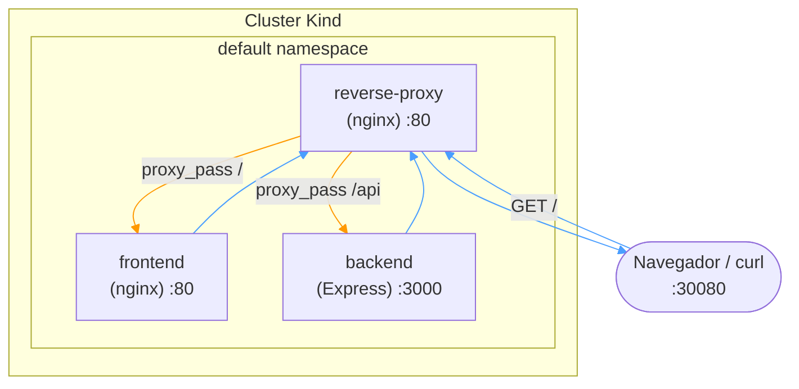
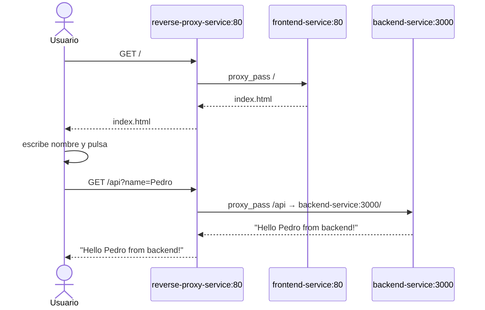

# demo-kind · _Despliegue Kubernetes con Kind_

Este proyecto despliega los mismos tres servicios (**reverse-proxy**, **frontend** y **backend**) del proyecto [demo-compose](https://github.com/mapfre-gitops-9/docker-compose), pero usando **Kind** (Kubernetes in Docker) como orquestador en lugar de docker-compose.

## Antecedentes

Este proyecto nace como evolución de [demo-compose](https://github.com/mapfre-gitops-9/demo-compose), donde los mismos servicios se orquestaban con `docker-compose`. En aquel repositorio puedes encontrar:

- El historial de problemas típicos al Meter contenedores en desarrollo (resolución de nombres, CORS, reverse proxy, etc.)
- Cada paso documentado como una lección independiente
- La versión "plana" con `docker-compose`

Este repositorio parte de esa misma base pero migrada a un despliegue Kubernetes sobre Kind.

## El proyecto

```
k8s/                        ← manifiestos Kubernetes
├── backend-deployment.yaml
├── backend-service.yaml
├── frontend-deployment.yaml
├── frontend-service.yaml
├── reverse-proxy-configmap.yaml
├── reverse-proxy-deployment.yaml
├── reverse-proxy-service.yaml
└── kustomization.yaml
backend/                    ← app Node.js/Express (misma que en demo-compose)
frontend/                   ← HTML estático servido por nginx (misma que en demo-compose)
reverse-proxy/              ← Dockerfile para construir imagen local (demo-compose)
```

La arquitectura es la misma que en la versión con docker-compose: el **reverse-proxy** es el único punto de entrada. Recibe todas las peticiones y decide:

| Ruta  | Destino                 | Servicio Kubernetes    |
|-------|-------------------------|------------------------|
| `/`   | `frontend-service:80`   | `frontend-service`     |
| `/api`| `backend-service:3000`  | `backend-service`      |





## Componentes Kubernetes

| Recurso | Tipo | Réplicas | Puerto |
|---------|------|----------|--------|
| `backend` | Deployment | 2 | 3000 |
| `frontend` | Deployment | 2 | 80 |
| `reverse-proxy` | Deployment | 1 | 80 |
| `backend-service` | Service (ClusterIP) | — | 3000 |
| `frontend-service` | Service (ClusterIP) | — | 80 |
| `reverse-proxy-service` | Service (NodePort) | — | 80 → `:30080` |
| `reverse-proxy-config` | ConfigMap | — | nginx default.conf |

El **reverse-proxy-service** se expone como `NodePort` en el puerto `30080` del host, siendo el único punto de entrada al clúster.

## Cómo desplegar

### Prerrequisitos

- [Docker](https://docker.com)
- [Kind](https://kind.sigs.k8s.io)
- [kubectl](https://kubernetes.io/docs/tasks/tools/)

### Pasos

```bash
# 1. Construir las imágenes Docker
docker build -t demo-compose-backend:latest ./backend
docker build -t demo-compose-frontend:latest ./frontend

# 2. Crear el clúster Kind (si no existe)
kind create cluster

# 3. Cargar las imágenes en el clúster
kind load docker-image demo-compose-backend:latest
kind load docker-image demo-compose-frontend:latest

# 4. Desplegar con kustomize
kubectl apply -k k8s/

# 5. Verificar que los pods están running
kubectl get pods

# 6. Probar
curl http://localhost:30080
# o abre http://localhost:30080 en el navegador
```

> **Nota:** El reverse-proxy usa la imagen `nginx:alpine` directamente con un ConfigMap, por lo que no necesita construcción ni carga adicional.

### Limpieza

```bash
# Eliminar el despliegue
kubectl delete -k k8s/

# Eliminar el clúster Kind
kind delete cluster
```
