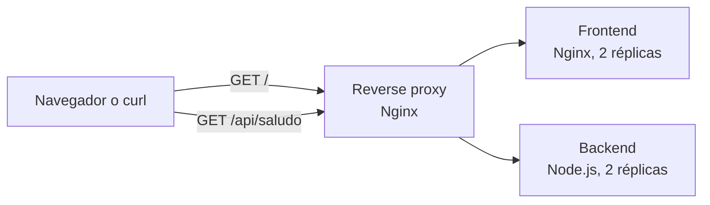

# demo-kind: de una aplicación a Kubernetes

Laboratorio autónomo para entender cómo se construye, despliega, observa y
mantiene una aplicación pequeña siguiendo prácticas habituales de un equipo
de ingeniería.

No necesitas haber completado el repositorio `demo-compose`. Si ya lo conoces,
este laboratorio continúa el recorrido desde Docker Compose hacia Kubernetes.

## Qué vas a construir

La aplicación tiene tres componentes:

- Un **reverse proxy** Nginx como único punto de entrada.
- Un **frontend** estático servido por Nginx.
- Una **API** Node.js que devuelve un saludo y la réplica que ha respondido.



La maqueta permite observar resolución DNS interna, Services, réplicas,
sondas, límites de recursos, configuración externa y recuperación automática.

## Objetivos

Al terminar podrás:

- Explicar la diferencia entre una imagen, un contenedor, un pod, un
  Deployment y un Service.
- Construir imágenes reproducibles que no se ejecutan como `root`.
- Desplegar la misma aplicación con dos overlays de Kustomize.
- Seguir una petición desde el navegador hasta una réplica del backend.
- Consultar logs, escalar, provocar un fallo y recuperar el servicio.
- Distinguir integración continua, publicación de artefactos, despliegue
  continuo y GitOps.
- Aplicar controles básicos de seguridad, privacidad y revisión por pares.

Duración orientativa: entre dos y tres horas.

## Elige tu recorrido

Los dos recorridos despliegan la misma arquitectura. El recorrido local añade
la construcción y carga de imágenes; el playground evita instalar herramientas
en el equipo.

### Recorrido local con Kind

Necesitas:

- Docker Engine, Rancher Desktop u otro motor compatible.
- [Kind](https://kind.sigs.k8s.io/docs/user/quick-start/).
- [kubectl](https://kubernetes.io/docs/tasks/tools/).

```bash
git clone https://github.com/mapfre-gitops-9/demo-kind.git
cd demo-kind

docker build -t demo-kind-backend:local ./backend
docker build -t demo-kind-frontend:local ./frontend

kind create cluster --name demo-kind
kind load docker-image demo-kind-backend:local --name demo-kind
kind load docker-image demo-kind-frontend:local --name demo-kind

kubectl apply -k k8s/overlays/local
kubectl wait --for=condition=available deployment \
  --all --namespace demo-kind --timeout=120s
```

Abre un segundo terminal y deja activo:

```bash
kubectl port-forward \
  --namespace demo-kind service/reverse-proxy-service 8080:80
```

Visita [http://localhost:8080](http://localhost:8080) o prueba:

```bash
curl "http://localhost:8080/api/saludo?alias=equipo-demo"
```

El recorrido usa `port-forward` porque un NodePort de Kind no se publica de
forma portable en el host sin configuración adicional.

### Recorrido desde el navegador

1. Abre el
   [Kubernetes Playground de Killercoda](https://killercoda.com/playgrounds/scenario/kubernetes).
2. Ejecuta:

```bash
git clone https://github.com/mapfre-gitops-9/demo-kind.git
cd demo-kind
kubectl apply -k k8s/overlays/playground
kubectl wait --for=condition=available deployment \
  --all --namespace demo-kind --timeout=180s
```

1. Abre `30080` desde **Traffic Port Accessor**.

El playground es público y temporal. No introduzcas credenciales, archivos
corporativos ni datos reales.

## Comprueba el resultado

```bash
kubectl get all --namespace demo-kind
curl "http://localhost:8080/api/saludo?alias=equipo-demo"
```

La respuesta tendrá esta forma:

```json
{
  "mensaje": "Hola, equipo-demo.",
  "instancia": "backend-xxxxxxxxxx-yyyyy"
}
```

Repite la petición. Kubernetes puede enviarla a distintas réplicas.

## Itinerario de aprendizaje

| Laboratorio | Qué aprenderás | Tiempo |
| --- | --- | --- |
| [1. Flujo HTTP y contenedores](docs/labs/01-flujo-http-y-contenedores.md) | Dónde se ejecuta cada pieza y cómo viaja una petición | 20 min |
| [2. Construcción de imágenes](docs/labs/02-construccion-de-imagenes.md) | Dockerfile, capas, dependencias y usuarios no privilegiados | 30 min |
| [3. Kind y Kustomize](docs/labs/03-kind-y-kustomize.md) | Despliegue declarativo y overlays | 35 min |
| [4. Observar, escalar y recuperar](docs/labs/04-observar-escalar-y-recuperar.md) | Logs, sondas, réplicas, fallos y reconciliación | 35 min |
| [5. Colaboración, CI y seguridad](docs/labs/05-colaboracion-ci-seguridad-ia.md) | GitHub Flow, controles automáticos y uso responsable de IA | 30 min |

## Maqueta y producción no son lo mismo

Este repositorio usa recursos y controles reales, pero no es una plantilla de
producción.

| Tema | En esta maqueta | En un entorno de producción |
| --- | --- | --- |
| Entrada | Proxy y port-forward o NodePort | Gateway/Ingress, balanceador y TLS |
| Identidad | No existe autenticación | Identidad corporativa y autorización |
| Secretos | No se necesitan | Gestor externo, cifrado y RBAC |
| Red | Comunicación abierta dentro del clúster | CNI compatible y NetworkPolicies |
| Disponibilidad | Kind de un nodo | Varios nodos, zonas y políticas de disrupción |
| Observabilidad | `kubectl`, logs y sondas | Métricas, trazas, logs centralizados y alertas |
| Imágenes | `latest` solo en el playground | Versiones inmutables o digests promovidos |
| Entrega | CI y publicación en GHCR | Promoción, despliegue y reconciliación controlados |

Consulta la
[explicación completa](docs/referencia/arquitectura-y-produccion.md).

## API

### `GET /api/saludo`

Parámetro opcional `alias`:

- Entre 1 y 32 caracteres después de eliminar espacios exteriores.
- Letras, números, espacios, guiones y guiones bajos.
- Si se omite, se usa `equipo`.
- Los valores inválidos reciben `400`.

Usa siempre alias ficticios. La aplicación no persiste ni registra este valor.

### `GET /healthz`

Devuelve el estado del backend y se utiliza desde las sondas de Kubernetes.

## Limpieza

```bash
kubectl delete -k k8s/overlays/local
kind delete cluster --name demo-kind
```

## Más información

- [Cómo contribuir](CONTRIBUTING.md)
- [Política de seguridad](SECURITY.md)
- [Arquitectura: maqueta frente a producción](docs/referencia/arquitectura-y-produccion.md)
- [Seguridad y respuesta ante incidentes](docs/referencia/seguridad.md)
- [Uso responsable de asistentes de IA](docs/referencia/uso-responsable-ia.md)
- [Procedencia y revisión del material](docs/referencia/procedencia.md)
- [Bitácora resumida del taller](docs/referencia/bitacora.md)
- [Mantenimiento de CI, GitHub y GHCR](docs/mantenimiento/github-y-ghcr.md)
