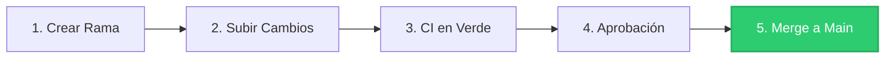

# Acuerdos de Trabajo y Flujo de Desarrollo Colaborativo

En los proyectos del equipo (e infraestructuras críticas como Kubernetes u OpenShift), el software se gestiona bajo el principio de **propiedad colectiva del código**. Esto significa que el código pertenece a la comunidad y al equipo como un todo, no a una única persona. 

Para garantizar la estabilidad del sistema, aprender unos de otros y mantener un estándar de calidad homogéneo, nos regimos por unos **acuerdos mínimos obligatorios** para cualquier cambio de código.

---

## El Flujo de Trabajo en 5 Pasos

Todo desarrollo (corrección de errores, mejoras o nueva documentación) debe seguir estrictamente este ciclo:



### 1. Crear una Rama de Trabajo (Feature Branch)
NUNCA trabajes o hagas commits directamente sobre la rama `main`.
*   Asegúrate de tener tu repositorio local actualizado con la versión más reciente:
    ```bash
    git checkout main
    git pull origin main
    ```
*   Crea una rama específica y descriptiva para tu tarea (usa el prefijo `feature/` o `fix/`):
    ```bash
    git checkout -b feature/nombre-de-tu-mejora
    ```

### 2. Subir tu Rama y Abrir una Pull Request (PR)
Realiza commits pequeños, atómicos y con mensajes claros. Cuando termines tus cambios locales:
*   Sube tu rama al repositorio remoto de GitHub:
    ```bash
    git push -u origin feature/nombre-de-tu-mejora
    ```
*   Ve a GitHub y abre una **Pull Request (PR)** hacia la rama `main`.

### 3. Esperar la Validación Automática (CI en Verde)
*   Una vez abierta la PR, el pipeline de integración continua (**GitHub Actions**) comenzará a compilar las imágenes del frontend y del backend de forma automática.
*   **Es obligatorio esperar a que todos los checks estén en verde** antes de continuar. Si hay algún fallo (un aspa roja), el autor del PR debe corregir el código en su rama y subir los cambios de nuevo.

### 4. Revisión por Pares (Peer Review)
El código compartido requiere validación humana para evitar errores lógicos y propagar buenas prácticas de diseño:
*   Solicita la revisión de tus compañeros.
*   **Se requiere al menos 1 aprobación (Approve)** de otro miembro del equipo para dar el visto bueno al cambio.
*   La revisión es un espacio de aprendizaje: sé constructivo al comentar y mantén la mente abierta para recibir sugerencias de mejora.

### 5. Integración (Merge) en `main`
*   Una vez que el pipeline automático está en verde y tienes al menos una aprobación, el cambio está listo.
*   Realiza el merge de la PR en la rama `main` en GitHub. El clúster compilará automáticamente las imágenes finales de producción y las publicará en GHCR.
*   Borra la rama remota y local que ya ha sido integrada para mantener limpio el entorno de trabajo:
    ```bash
    git branch -d feature/nombre-de-tu-mejora
    ```
