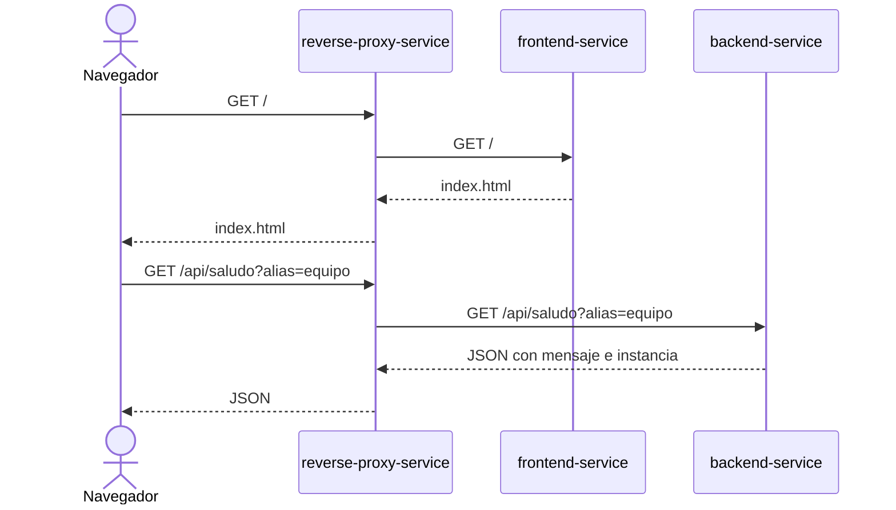

# Arquitectura: maqueta frente a producción

## Flujo de la petición

El reverse proxy es el único punto de entrada de la aplicación. Los Services
proporcionan nombres DNS y seleccionan pods preparados mediante etiquetas.

## Conceptos que conviene distinguir

### Docker Compose y Kubernetes

Docker Compose también usa un modelo declarativo: el archivo Compose describe
servicios, redes y volúmenes. Kubernetes amplía la reconciliación, planificación
y gestión de cargas distribuidas, pero “declarativo” no es una diferencia
exclusiva.

Fuente:
[What is Docker Compose?](https://docs.docker.com/get-started/docker-concepts/the-basics/what-is-docker-compose/).

### Kustomize y GitOps

Kustomize transforma y combina manifiestos. GitOps requiere además que un
controlador autorizado observe una fuente Git y reconcilie el estado del
clúster. Ejecutar `kubectl apply -k` manualmente sigue siendo infraestructura
declarativa, no un proceso GitOps completo.

### Namespaces y aislamiento

Un namespace separa nombres, cuotas y ámbitos de permisos. No bloquea por sí
solo el tráfico entre pods. Ese aislamiento necesita un CNI compatible y
NetworkPolicies.

Fuente:
[modelo de red de Kubernetes](https://kubernetes.io/docs/concepts/services-networking/).

Kind usa por defecto una red adecuada para el laboratorio, pero no se incluyen
NetworkPolicies que el entorno no vaya a aplicar.

### Services, NodePort y port-forward

Un Service ofrece un endpoint estable para pods cambiantes. `ClusterIP` solo es
accesible dentro del clúster. `NodePort` publica un puerto en los nodos, pero
los nodos de Kind son contenedores: con Docker Desktop o hosts remotos se
necesita mapear el puerto.

Fuente:
[configuración de Kind](https://kind.sigs.k8s.io/docs/user/configuration/).

El recorrido local usa `kubectl port-forward`; el playground usa NodePort
porque su plataforma publica ese puerto.

### CI, CD y GitOps

- **CI:** integra cambios y ejecuta validaciones automáticas.
- **Publicación:** genera y almacena artefactos, como imágenes OCI.
- **Despliegue continuo:** aplica automáticamente una versión a un entorno.
- **GitOps:** reconcilia el entorno con un estado versionado en Git.

El pipeline de este repositorio implementa los dos primeros puntos.

## Qué falta para producción

| Área | Maqueta | Producción |
| --- | --- | --- |
| Tráfico | HTTP local | TLS, Gateway/Ingress, DNS y WAF según riesgo |
| Identidad | Sin autenticación | SSO, autorización y sesiones seguras |
| Configuración | ConfigMap de Nginx | Configuración validada y promovida |
| Secretos | Ninguno | Gestor externo, cifrado en reposo y RBAC mínimo |
| Red | Sin políticas | Default deny y flujos permitidos explícitos |
| Cómputo | Un nodo Kind | Varios nodos y zonas, afinidad y disrupciones |
| Escalado | Réplicas fijas | Métricas, HPA y pruebas de capacidad |
| Observabilidad | Logs y sondas | Logs, métricas, trazas, SLO y alertas |
| Imágenes | Tag mutable en playground | Digest inmutable, firma y promoción |
| Entrega | Aplicación manual | Despliegue controlado y rollback verificado |
| Gobierno | Revisión y CI | Políticas, auditoría, segregación y evidencias |

Dos réplicas en un único nodo no sobreviven a la caída del nodo. Una sonda
tampoco sustituye monitorización de negocio ni pruebas de capacidad.
